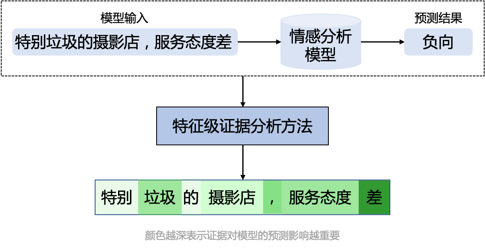
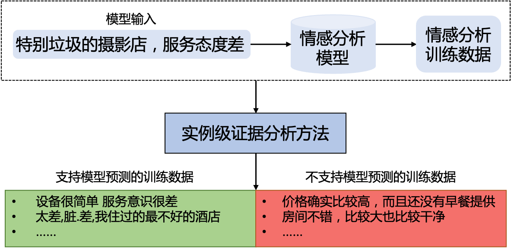
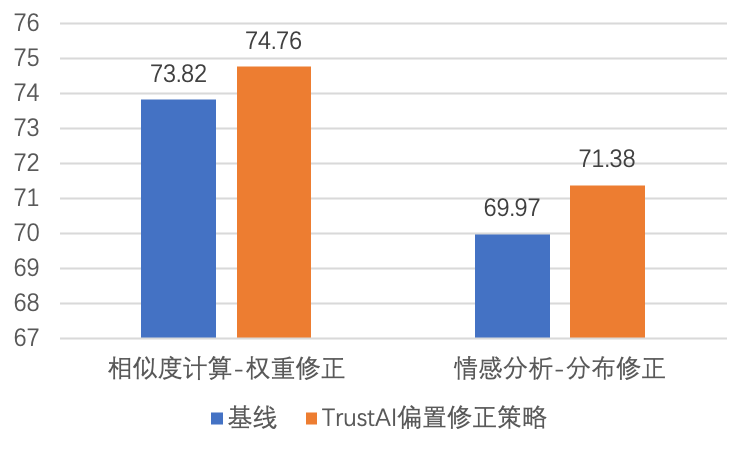
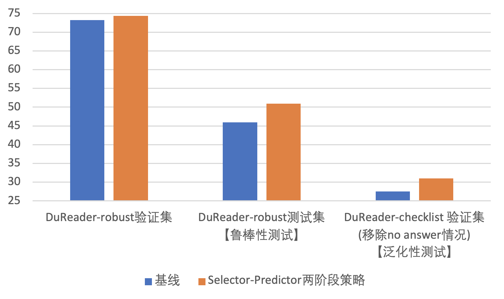

<p align="center">
  
</p>


<p align="center">
<a href="https://pypi.org/project/trustai/"></a>
<a href="./LICENSE"></a>
<a href=""></a>
<a href=""></a>
</p>

<h4 align="center">
  <a href=#安装> 安装 </a> |
  <a href=#快速开始> 快速开始 </a>|
  <a href=#可信分析功能> 可信分析功能 </a> |
  <a href=#可信增强功能> 可信增强功能 </a> |
  <a href=#应用案例> 应用案例 </a> |
  <a href=#评测榜单> 评测榜单 </a>
</h4>

**TrustAI**是基于深度学习平台『飞桨』([PaddlePaddle](https://github.com/PaddlePaddle/Paddle))开发的集可信分析和增强于一体的可信AI工具集，助力NLP开发者提升深度学习模型效果和可信度，推动模型安全、可靠的落地于应用。


## News 📢
* 🔥 2022.8.29 [PaddleNLP分类系统](https://github.com/PaddlePaddle/PaddleNLP/tree/develop/applications/text_classification)已经接入TrustAI能力，欢迎大家试用。
* 🔥 2022.8.29 [2022 CCF BDCI 基于文心NLP大模型的阅读理解可解释评测](https://aistudio.baidu.com/aistudio/competition/detail/394/0/introduction)赛事启动，火热报名中。
* 🔥 2022.8.20 TrustAI[发布](https://mp.weixin.qq.com/s/Ph3uzbUEUj1K7UALdM6OCA)可信增强能力及应用案例。
* 🔥 2022.8.8 [兴智杯-深度学习模型可解释性赛](http://www.aiinnovation.com.cn/#/trackDetail?id=23)启动，火热报名中。
* 🎉 2022.5.20 TrustAI首次[发布](https://mp.weixin.qq.com/s/AqYReKRnki9TwI5huY1f5Q)！

## <p id="可信分析功能">👏可信分析功能</p>
TrustAI提供特征级证据和实例级证据分析方法，全方位解释模型的预测，帮助开发者了解模型预测机制，以及协助使用者基于证据做出正确决策。

### 特征级证据分析

根据模型预测结果，从输入文本中提取模型预测所依赖的证据，即输入文本中支持模型预测的重要词。

<p align="center">
  
</p>

应用示例见AI Studio - [基于TrustAI的中文情感特征级可信分析示例](https://aistudio.baidu.com/aistudio/projectdetail/4431334)

关于方法更多详细内容可参考 - [特征级证据分析文档](./trustai/interpretation/token_level/README.md)

### 实例级证据分析


从训练数据中找出对当前预测影响较大的若干实例数据作为预测证据。
<p align="center">
  
</p>


应用示例见AI Studio - [基于TrustAI的中文情感实例级可信分析示例](https://aistudio.baidu.com/aistudio/projectdetail/4433286)

关于方法更多详细内容可参考 - [实例级证据分析文档](./trustai/interpretation/example_level/README.md)

## <p id="可信增强功能">💥可信增强功能</p>

除了提供可信分析结果以外，TrustAI还包含多项增强功能，能够帮助开发者解决训练数据缺陷问题，用最小的标注成本获得最大幅度的效果提升。

### 解决训练数据存在脏数据的问题


TrustAI提供了脏数据（即标注质量差的数据）自动识别功能，帮助降低人工检查数据的成本。

如下图所示，在两个公开数据集上，TrustAI自动识别的脏数据比例远高于随机选择策略。

<p align="center">
<br>
图1 不同策略识别出的脏数据比例
</p>

应用示例见AI Studio - [解决训练数据存在脏数据的问题](https://aistudio.baidu.com/aistudio/projectdetail/4434058)

### 解决文本冗余导致精度下降的问题

训练数据覆盖不足会导致模型在对应的测试数据上表现不好。TrustAI可识别因训练数据覆盖不足而导致的预测效果差的测试样本（这些样本构成的集合称为目标集），并帮助开发者从未标注数据中选择有效数据进行标注，提高训练数据覆盖度和模型效果。

如下图所示，在两个公开数据集上，TrustAI选择的有效数据对模型在目标数据上的效果提升远高于随机选择策略。

<p align="center">
<br>
图2 目标集提升的效果
</p>

应用示例见AI Studio - [解决训练数据覆盖不足的问题](https://aistudio.baidu.com/aistudio/projectdetail/4434403)


### 解决训练数据分布偏置的问题
神经网络模型会利用数据集中的偏置做预测，这会导致模型没有学会理解语言，鲁棒性差。TrustAI提供了分布修正和权重修正两种策略，在不需要人工介入的条件下，有效缓解数据偏置对模型训练的影响。

如下图所示，在两个公开的鲁棒性数据集上，TrustAI的权重修正和分布修正策略分别取得明显提升。

<p align="center">
<br>
图3 偏置修正后模型在鲁棒性数据集上的效果
</p>

应用示例见AI Studio - [数据权重修正](https://aistudio.baidu.com/aistudio/projectdetail/4434616)和[数据分布修正](https://aistudio.baidu.com/aistudio/projectdetail/4434652)

### 解决文本冗余导致精度下降的问题
过长的冗余信息往往会导致神经网络模型做预测时发生误判。这会导致模型难以处理长文本，鲁棒性、泛化性差。TrustAI提供了Select-Predict两阶段策略，在不需要人工介入的条件下，有效缓解文本冗余导致精度下降的问题。

如下图所示，在如下3个数据集上，TrustAI的域内预测精度、泛化性、鲁棒性在EM指标上均取得明显提升。

<p align="center">
<br>
图4 偏置修正后模型在鲁棒性数据集上的效果
</p>

应用示例见[ AI Studio ](https://aistudio.baidu.com/aistudio/projectdetail/4525331)

**关于可信增强更多内容请阅读[tutorials](./tutorials)。**


## 安装

### 依赖
* `python`: >=3.6.2
* [`paddlepaddle`](https://www.paddlepaddle.org.cn/): >=2.0

### pip 安装

```shell
# 依赖paddlepaddle，推荐安装CUDA版本
pip install -U paddlepaddle-gpu
pip install -U trustai
```

### 源码编译
```shell
git clone git@github.com:PaddlePaddle/TrustAI.git
cd TrustAI
python setup.py install
```


## 快速开始

### 特征级证据分析
<details><summary>&emsp;以Integrated Gradient方法为例，其调用方法如下所示：</summary>

```python
from trustai.demo import DEMO
from trustai.interpretation import IntGradInterpreter
from trustai.interpretation import visualize

demo = DEMO('chnsenticorp')
# init demo model
model = demo.get_model()
tokens, model_inputs = demo("这个宾馆比较陈旧了")
# tokens: List[List[str]], [['[CLS]', '这', '个', '宾', '馆', '比', '较', '陈', '旧', '了', '[SEP]']]
# model_inputs: List[Paddle.Tensor]，满足`logits = model(*model_inputs)`
# init interpreter
interpreter = IntGradInterpreter(model)
result = interpreter(model_inputs)
# result: List[IGResult], result[0].attribtions与tokens[0]一一对应，表示每一个token对预测结果的支持程度，即证据的支持度分数。
# result[0].attributions: [ 0.04054353,  0.12724458, -0.00042592,  0.01736268,  0.07130871, -0.00350687,
#                           0.01605285,  0.04392833,  0.04841821, -0.00514487,  0.13098583]

# 可视化结果
html = visualize(result, words=tokens)
# TrustAI提供可视化输出，即根据输入特征的支持度，以不同颜色深度展示结果。颜色越深表示支持度越大，越浅表示支持度越小。
```

&emsp;更多详情 - [特征级证据分析文档](./trustai/interpretation/token_level/README.md)


</details>


### 实例级证据分析

<details><summary>&emsp;以Feature Similarity方法为例，其调用方法如下所示：</summary>

```python
from trustai.demo import DEMO
from trustai.interpretation import FeatureSimilarityModel
demo = DEMO('chnsenticorp')
# init demo model
model = demo.get_model()
tokens, model_inputs = demo("房间设备比较陈旧，没五星标准 客人非常不满意")
# tokens: List[List[str]]
# model_inputs: List[Paddle.Tensor]，满足`logits = model(*model_inputs)`
# get dataloader of train data, 满足`logits = model(*next(train_data_loader))`
train_data, train_dataloader = demo.get_train_data_and_dataloader()
# init interpreter
interpreter = FeatureSimilarityModel(model, train_dataloader, classifier_layer_name='classifier')
result = interpreter(model_inputs)
# result: List[ExampleResult], [ExampleResult(pred_label=0, pos_indexes=(7112, 1757, 4487), neg_indexes=(8952, 5986, 1715), pos_scores=(0.9454082250595093, 0.9445762038230896, 0.9439479112625122), neg_scores=(-0.2316494882106781, -0.23641490936279297, -0.23641490936279297))]
# ExampleResult.pos_indexes: List[int], 支持当前预测的训练数据在训练集中的索引
# ExampleResult.neg_indexes: List[int], 不支持当前预测的训练数据在训练集中的索引
# ExampleResult.pos_scores: List[float], 支持当前预测的训练数据的支持度
# ExampleResult.neg_scores: List[float], 不支持当前预测的训练数据的支持度
```

&emsp;更多详情 - [实例级证据分析文档](./trustai/interpretation/example_level/README.md)

</details>

关于接口使用的更多样例见[examples目录](./examples)


## <p id="应用案例">🚀应用案例</p>


</details>
<details><summary> &emsp;自动识别脏数据，降低人力检查成本 </summary>
</br>

&emsp;&emsp;&emsp;[解决训练数据存在脏数据的问题](./tutorials/dirty_data_identification)

</details>
<details><summary> &emsp;标注尽量少的数据，提升模型效果 </summary>
</br>

&emsp;&emsp;&emsp;[解决训练数据覆盖不足的问题](./tutorials/sparse_data_identification)
</details>

<details><summary> &emsp;缓解数据偏置对模型训练的影响，提升模型鲁棒性 </summary>

&emsp;&emsp;&emsp;[解决训练数据分布偏置的问题 - 数据权重修正](./tutorials/data_bias_identification/less_learn_shortcut)

&emsp;&emsp;&emsp;[解决训练数据分布偏置的问题 - 数据分布修正](./tutorials/data_bias_identification/data_distribution_correction)

</details>

</br>

关于应用案例的更多说明，请参考[tutorials目录](./tutorials/)

## 评测榜单

评测数据集下载：[千言数据集-可解释性评测](https://www.luge.ai/#/luge/task/taskDetail?taskId=15)

<details><summary> &emsp;限时赛</summary>

* [2022 CCF BDCI 基于文心NLP大模型的阅读理解可解释评测](https://aistudio.baidu.com/aistudio/competition/detail/394/0/introduction)，比赛时间：2022/08/29 - 2022/12/31
* [兴智杯-深度学习模型可解释性赛事](http://www.aiinnovation.com.cn/#/trackDetail?id=23)，比赛时间：2022/08/08 - 2022/10/31

</details>

<details><summary> &emsp;常规赛</summary>

* [千言数据集：情感分析可解释性评测（中文）](https://aistudio.baidu.com/aistudio/competition/detail/443/0/introduction)
* [千言数据集：情感分析可解释性评测（英文）](https://aistudio.baidu.com/aistudio/competition/detail/449/0/introduction)
* [千言数据集：文本相似度可解释性评测（中文）](https://aistudio.baidu.com/aistudio/competition/detail/445/0/introduction)
* [千言数据集：文本相似度可解释性评测（英文）](https://aistudio.baidu.com/aistudio/competition/detail/451/0/introduction)
* [千言数据集：阅读理解可解释性评测（中文）](https://aistudio.baidu.com/aistudio/competition/detail/447/0/introduction)
* [千言数据集：阅读理解可解释性评测（英文）](https://aistudio.baidu.com/aistudio/competition/detail/453/0/introduction)

</details>


## 相关文献

<details><summary> &emsp;可信分析方法参考论文 </summary>

* `IntegratedGraients`: [Axiomatic Attribution for Deep Networks, Mukund Sundararajan et al. 2017](https://arxiv.org/abs/1703.01365)
* `GradientShap`: [A Unified Approach to Interpreting Model Predictions, Scott M. Lundberg et al. 2017](http://papers.nips.cc/paper/7062-a-unified-approach-to-interpreting-model-predictions)
* `Lime`: ["Why Should I Trust You?": Explaining the Predictions of Any Classifier, Marco Tulio Ribeiro et al. 2016](https://arxiv.org/abs/1602.04938)
* `NormLime`: [NormLime: A New Feature Importance Metric for Explaining Deep Neural Networks, Isaac Ahern et al. 2019](https://arxiv.org/abs/1909.04200)
* `Attention`: [Attention is not explanation, S Jain et al. 2019](https://arxiv.org/pdf/1902.10186.pdf)
* `Representer Pointer`:[Representer point selection for explaining deep neural networks, Chih-Kuan Yeh et al. 2018](https://proceedings.neurips.cc/paper/2018/file/8a7129b8f3edd95b7d969dfc2c8e9d9d-Paper.pdf)
* `Evaluation`: [A Fine-grained Interpretability Evaluation Benchmark for Neural NLP, Wang Lijie, et al. 2022](https://arxiv.org/pdf/2205.11097.pdf)

</details>

<details><summary> &emsp;可信增强方法参考论文 </summary>

  * `Bias` : [Towards Debiasing NLU Models from Unknown Biases](https://arxiv.org/pdf/2009.12303v4.pdf)
  * `Bias` : [Towards Interpreting and Mitigating Shortcut Learning Behavior of NLU Models](https://arxiv.org/pdf/2103.06922.pdf)
  * `Bias` : [Learning to Learn to be Right for the Right Reasons](https://aclanthology.org/2021.naacl-main.304/)
  * `Robustness` : [Can Rationalization Improve Robustness](https://arxiv.org/pdf/2204.11790v1.pdf)

</details>

<details><summary> &emsp;进阶学习材料 </summary>

* `tutorials` : [ACL 2020 tutorial: Interpretability and Analysis in Neural NLP](https://web.stanford.edu/class/archive/cs/cs224n/cs224n.1204/slides/cs224n-2020-lecture20-interpretability.pdf) | [Video](https://www.youtube.com/watch?v=RkYASrVFdlU)
* `tutorials` : [EMNLP 2020 Tutorial on Interpreting Predictions of NLP Models](https://github.com/Eric-Wallace/interpretability-tutorial-emnlp2020) | [Video](https://www.youtube.com/watch?v=gprIzglUW1s)
* `tutorials` : [NAACL 2021 tutorial：Fine-grained Interpretation and Causation Analysis in Deep NLP Models](https://aclanthology.org/2021.naacl-tutorials.2.pdf) | [Video](https://www.youtube.com/watch?v=gprIzglUW1s)
* `Survey` : [Teach Me to Explain: A Review of Datasets for Explainable Natural Language Processing](https://openreview.net/pdf?id=ogNcxJn32BZ)
* `Survey` : [Benchmarking and Survey of Explanation Methods for Black Box Models](https://arxiv.org/pdf/2102.13076.pdf)
* `Survey` : [A Survey on the Explainability of Supervised Machine Learning](https://dl.acm.org/doi/pdf/10.1613/jair.1.12228)


</details>

<details><summary> &emsp;各赛事优秀方案分享 </summary>

  * `情感可解释` : [情感可解释前三方案分享](https://aistudio.baidu.com/aistudio/competition/detail/443/0/datasets)（需报名）

</details>


## 引用
要引用 TrustAI 进行研究，请使用以下格式进行引用。
```
@article{wang2022fine,
  title={A Fine-grained Interpretability Evaluation Benchmark for Neural NLP},
  author={Wang, Lijie and Shen, Yaozong and Peng, Shuyuan and Zhang, Shuai and Xiao, Xinyan and Liu, Hao and Tang, Hongxuan and Chen, Ying and Wu, Hua and Wang, Haifeng},
  journal={arXiv preprint arXiv:2205.11097},
  year={2022}
}
```

## 致谢
我们实现的可信分析方法参考和依赖了[InterpretDL](https://github.com/PaddlePaddle/InterpretDL)项目，在此向InterpretDL的作者表示感谢。

## LICENSE
TrustAI遵循[Apache-2.0开源协议](./LICENSE)。
