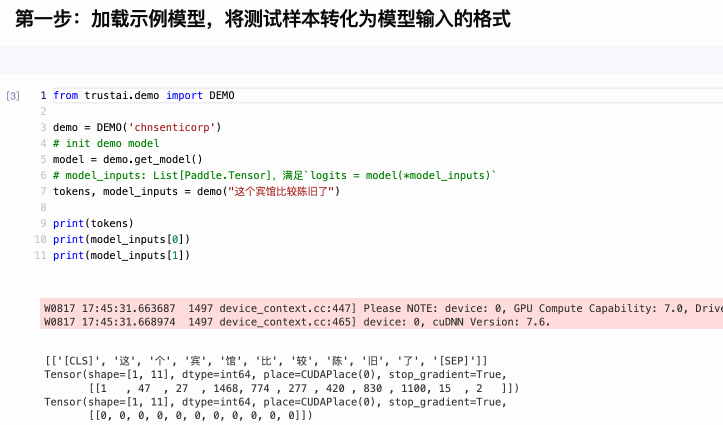
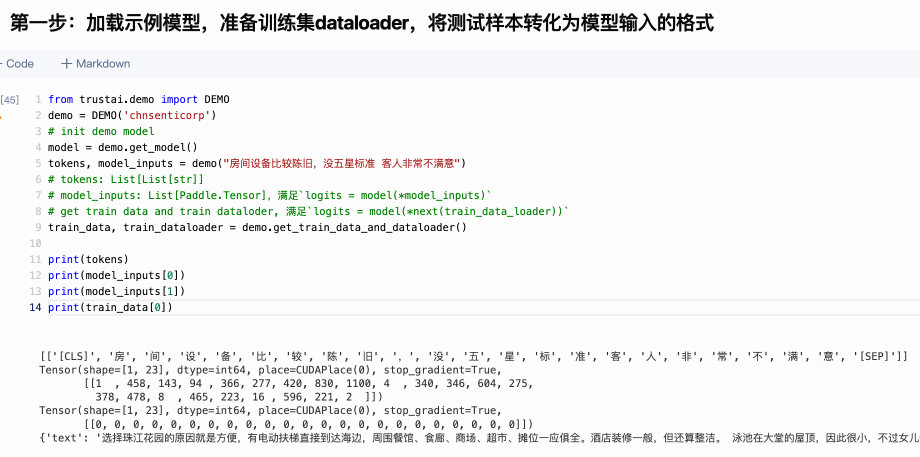
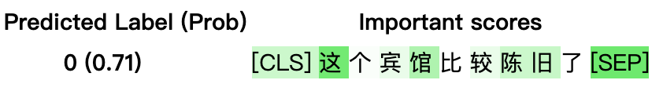

<p align="center">
  
</p>


<p align="center">
<a href="https://pypi.org/project/trustai/"></a>
<a href="./LICENSE"></a>
<a href=""></a>
<a href=""></a>
</p>

<h4 align="center">
  <a href=#可信分析> 分析 </a> |
  <a href=#可信增强> 增强 </a> |
  <a href=#安装> 安装 </a> |
  <a href=#快速开始> 快速开始 </a>
</h4>

**TrustAI**是百度基于产业级深度学习平台『飞桨』([PaddlePaddle](https://github.com/PaddlePaddle/Paddle))开发的集可信分析和增强于一体的可信AI工具集，助力开发者提升模型效果和可信度，推动模型安全、可靠的落地于应用。


## News 📝
* 🚀 2021.5.20 **TrustAI**首次[发布](https://mp.weixin.qq.com/s/AqYReKRnki9TwI5huY1f5Q)！


## ✨可信分析
TrustAI提供特征级证据和实例级证据分析方法，全方位解释模型的预测，帮助开发者了解模型预测机制，以及协助使用者基于证据做出正确决策。

### 特征级证据分析

根据模型预测结果，从输入文本中提取模型预测所依赖的证据，即输入文本中支持模型预测的重要词，特征的重要度分数由显著性方法（saliency methods）给出。

<p align="center">
  
</p>

特征级证据分析方法的详细示例见[基于TrustAI的中文情感特征级可信分析示例](https://aistudio.baidu.com/aistudio/projectdetail/4431334)。

**更多使用方法可参考[特征级证据分析文档](./trustai/interpretation/token_level/README.md)。**

### 实例级证据分析

从训练数据中找出对当前预测影响较大的若干实例数据作为预测证据，实例的影响度一般由influence function（影响函数）确定。
<p align="center">
  
</p>

实例级证据分析方法的详细示例见[基于TrustAI的中文情感实例级可信分析示例](https://aistudio.baidu.com/aistudio/projectdetail/4433286)。

**更多使用方法可参考[实例级证据分析文档](./trustai/interpretation/example_level/README.md)。**

## 💥可信增强
TrustAI提供基于可信分析结果指导模型优化的方法，可以帮助NLP开发者解决数据训练数据缺陷，提升模型训练效果。

### 解决训练数据存在脏数据的问题


TrustAI提供了脏数据（即标注质量差的数据）自动识别功能，帮助降低人工检查数据的成本。如下图所示，在两个公开数据集上，TrustAI自动识别的脏数据比例远高于随机选择策略。
<p align="center">
<br>
图1 不同策略识别出的脏数据比例
</p>

详细用法见[解决训练数据存在脏数据的问题](https://aistudio.baidu.com/aistudio/projectdetail/4434058)。

### 解决训练数据覆盖不足的问题

TrustAI可识别当前验证集中哪些数据在训练集中覆盖不足（数据稀释），并提供标注哪些数据可更有效提升模型效果的建议。

详细用法见[解决训练数据覆盖不足的问题](https://aistudio.baidu.com/aistudio/projectdetail/4434403)。


### 解决训练数据分布偏置的问题
神经网络模型会利用数据集中的偏置作为预测的捷径，如在情感分析任务中，遇到否定词模型会倾向预测为`负向`情感。这种偏置会导致模型没有真正理解语言，导致模型的鲁棒性降低。

TrustAI提供偏置识别和修正策略，在不需要人工介入的条件下，缓解训练数据偏置对模型训练的影响。

详细用法见[数据权重修正]()和[数据分布修正]()。

**关于可信增强更多内容见[tutorials](./tutorials)。**


## 使用方法

### 安装

#### 依赖
* `python`: >=3.6.2
* [`paddlepaddle`](https://www.paddlepaddle.org.cn/): >=2.0

#### 一键安装
用户可以使用以下方式进行一键安装：
```shell
# 依赖paddlepaddle，推荐安装CUDA版本
pip install -U paddlepaddle-gpu
# cpu 版本
# pip install -U paddlepaddle

# pip 安装trustai
pip install -U trustai


# 源码安装
git clone git@github.com:PaddlePaddle/TrustAI.git
cd TrustAI
python setup.py install
```

### 快速开始

**特征级证据分析**

以Integrated Gradient方法为例，其调用方法如下所示：
```python
from trustai.demo import DEMO
from trustai.interpretation import IntGradInterpreter
demo = DEMO('chnsenticorp')
# init demo model
model = demo.get_model()
tokens, model_inputs = demo("这个宾馆比较陈旧了")
# tokens: List[List[str]], [['[CLS]', '这', '个', '宾', '馆', '比', '较', '陈', '旧', '了', '[SEP]']]
# model_inputs: List[Paddle.Tensor]，满足`logits = model(*model_inputs)`
# init interpreter
interpreter = IntGradInterpreter(model)
result = interpreter(model_inputs)
# result: List[IGResult], result[0].attribtions与tokens[0]一一对应，表示每一个token对预测结果的支持程度，即证据的重要度分数。
# result[0].attributions: [ 0.04054353,  0.12724458, -0.00042592,  0.01736268,  0.07130871, -0.00350687,
#                           0.01605285,  0.04392833,  0.04841821, -0.00514487,  0.13098583]
```

</br>

TrustAI提供可视化输出，即根据输入特征的重要度，以不同颜色深度展示结果。颜色越深表示重要度越大，越浅表示重要度越小。
```python
# 可视化结果
from trustai.interpretation import visualize

html = visualize(result, words=tokens)
```

</br>

可视化展示：

<p align="center">
<br>
图2 可视化示例：样本来自情感分析任务
</p>

<font size=2color=gray> 注：Predicted Label是模型对测试样本预测的标签，Prob是预测的概率。</font>

</br>

**实例级证据分析**

```python
from trustai.demo import DEMO
from trustai.interpretation import FeatureSimilarityModel
demo = DEMO('chnsenticorp')
# init demo model
model = demo.get_model()
tokens, model_inputs = demo("房间设备比较陈旧，没五星标准 客人非常不满意")
# tokens: List[List[str]]
# model_inputs: List[Paddle.Tensor]，满足`logits = model(*model_inputs)`
# get dataloader of train data, 满足`logits = model(*next(train_data_loader))`
train_data, train_dataloader = demo.get_train_data_and_dataloader()
# init interpreter
interpreter = FeatureSimilarityModel(model, train_dataloader, classifier_layer_name='classifier')
result = interpreter(model_inputs)
# result: List[ExampleResult], [ExampleResult(pred_label=0, pos_indexes=(7112, 1757, 4487), neg_indexes=(8952, 5986, 1715), pos_scores=(0.9454082250595093, 0.9445762038230896, 0.9439479112625122), neg_scores=(-0.2316494882106781, -0.23641490936279297, -0.23641490936279297))]
# ExampleResult.pos_indexes: List[int], 正影响证据（支持模型预测）在训练集中的索引。
# ExampleResult.neg_indexes: List[int], 负影响证据（不支持模型预测）在训练集中的索引。
# ExampleResult.pos_scores: List[float], 正影响证据的证据分数
# ExampleResult.neg_scores: List[float], 负影响证据的证据分数
```


## 参考资料

* `IntegratedGraients`: [Axiomatic Attribution for Deep Networks, Mukund Sundararajan et al. 2017](https://arxiv.org/abs/1703.01365)
* `GradientShap`: [A Unified Approach to Interpreting Model Predictions, Scott M. Lundberg et al. 2017](http://papers.nips.cc/paper/7062-a-unified-approach-to-interpreting-model-predictions)
* `Lime`: ["Why Should I Trust You?": Explaining the Predictions of Any Classifier, Marco Tulio Ribeiro et al. 2016](https://arxiv.org/abs/1602.04938)
* `NormLime`: [NormLime: A New Feature Importance Metric for Explaining Deep Neural Networks, Isaac Ahern et al. 2019](https://arxiv.org/abs/1909.04200)
* `Attention`: [Attention is not explanation, S Jain et al. 2019](https://arxiv.org/pdf/1902.10186.pdf)
* `Representer Pointer`:[Representer point selection for explaining deep neural networks, Chih-Kuan Yeh et al. 2018](https://proceedings.neurips.cc/paper/2018/file/8a7129b8f3edd95b7d969dfc2c8e9d9d-Paper.pdf)
* `DuTrust`: [DuTrust: A Sentiment Analysis Dataset for Trustworthiness Evaluation, Wang Lijie, et al. 2021](https://arxiv.org/pdf/2108.13140.pdf)
* `Evaluation`: [A Fine-grained Interpretability Evaluation Benchmark for Neural NLP, Wang Lijie, et al. 2022](https://arxiv.org/pdf/2205.11097.pdf)

## 开源计划安排
- 证据主动学习框架，2022.8

## Acknowledge
我们实现的可信分析方法参考和依赖了[InterpretDL](https://github.com/PaddlePaddle/InterpretDL)项目，在此向InterpretDL的作者表示感谢。

## LICENSE
TrustAI遵循[Apache-2.0开源协议](./LICENSE)。
