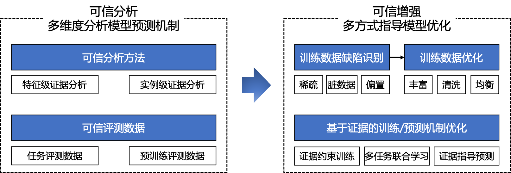
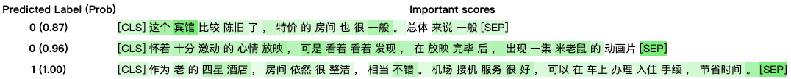

# TrustAI


## 目录结构
- [项目介绍](#项目介绍)
- [为什么选择TrustAI](#为什么选择TrustAI)
- [功能介绍](#功能介绍)
- [使用方法](#使用方法)
- [计划安排](#计划安排)
- [参考资料](#参考资料)
- [LICENSE](#LICENSE)


[](./LICENSE)
## 项目介绍
TrustAI是百度基于产业级深度学习平台『飞桨』([PaddlePaddle](https://github.com/PaddlePaddle/Paddle))开发的集评测、分析、增强于一体的可信AI工具集，助力开发者提升模型效果和可信度，推动模型安全、可靠的落地于应用。

<p align="center">
<br>
图1 TrustAI功能概览
</p>


## 为什么选择TrustAI

深度学习模型在NLP任务上已经取得巨大成功，但其常被当作一个黑盒使用，内部决策机制对使用者是不透明的。这种不透明性导致深度学习模型结果不被使用者信任，增加其落地难度，尤其是在医疗、法律等特殊领域。同时，这种不透明性也使得模型解释性差，很难诊断模型问题所在，难以改进及优化模型。

TrustAI从模型可解释性角度出发，旨在通过分析模型预测证据，发现模型缺陷及提出模型增强方案。本工具集提供了可信评测、可信分析及可信增强等工具。

- **可信评测工具**提供了细粒度人工标注证据，覆盖3个语言理解任务和预训练模型的评测数据，从多维度全面评估模型的可信度。
- **可信分析工具**旨在分析模型预测依赖的证据，提供了两类分析工具，分别为从预测输入中找出对预测结果影响最重要的token集合(token级证据分析)、及从训练数据中找出对预测影响最大的实例集合(实例级证据分析)。
- **可信增强工具**提供了基于可信分析的通用增强方案，旨在提升模型本身效果和可信度。

<p align="center">
<br>
图2 基于实例演示TrustAI服务能力
</p>

## 功能介绍

### 可信评测

基于模型提供的预测依赖证据，TrustAI从多维度给出评估结果，如图2可信评测中的模型评测报告部分所示。

我们提供了3个任务的评测数据，分别是情感分析、相似度计算和阅读理解，图3给出了情感分析任务上的评测数据实例；同时，我们还提供了预训练模型评测数据，分别从语法、语义、知识、推理、计算等维度评测预训练语言模型的能力，标注实例见图4。


<p align="center">
<br>
图3 情感分析标注数据
</p>
<br>

<p align="center">
<br>
图4 预训练模型标注数据
</p>


*注：颜色表示证据，同一个颜色表示同一个证据集合*<br>

**TrustAI**既可以评测模型的可解释性，又可以评估证据抽取方法的可解释性。我们从合理性和忠诚性两个维度对模型的提供的证据进行评估。

- **合理性**： 模型给出证据是否符合人类认知和理解，即模型提供证据与人工标注证据的拟合程度。
- **忠诚性**：模型实际上是否依赖提供的证据做的预测，以及模型提供的证据是否是稳定的。

对于合理性，我们提供了2个评测指标，对于忠诚性，我们提供了3个评测指标，具体见[evluation](./trustai/evaluation/README.md)。

### 可信分析

可信分析给出模型预测依赖的证据，是一种Post-hoc Explanation（后验解释分析）。本工具提供了Token级和实例级两种粒度的证据分析方法。

**Token级证据**：由输入中若干重要tokens（字或词）构成证据。Token的重要度分数由显著性方法（saliency methods）给出。我们的工具集提供了3种常用的显著性分析方法，分别是基于梯度的（Gradient-based中的integrated Gradient）、基于注意力权重的（Attention-based，与具体模型结构相关）、以及基于线性模型（Linear-based中的LIME）的，如图1**可信分析**中**Token级证据分析**部分所示。
其中，证据一般由top N重要词构成，该N的选择依赖经验或实际数据。
<p align="center">
<br>
图5 基于IG方法给出的token重要度，红色标注的token就是选择的证据
</p>

**实例级证据**：由训练数据中对该预测影响重大的若干条实例数据构成。实例的影响度一般由influence function（影响函数）确定。我们的工具集提供了基于表示点学习的实例级证据分析方法。

关于Token级证据和实例级证据使用示例分别见[token_level](./trustai/interpretation/token_level/README.md)和[example_level](./trustai/interpretation/example_level/README.md)。

其他更多的证据分析方法参考[InterpretDL](https://github.com/PaddlePaddle/InterpretDL)。


### 可信增强
TrustAI提供基于可解释性结果指导模型优化的示例，可以帮助开发者根据分析结果改进模型。

本工具基于可信分析结果对模型缺陷进行分析，继而给出模型增强方案。由于具体模型的问题需具体分析，我们这里给出一些有效的候选方案，希望这些方案能够激发大家对自己的模型进行问题分析及效果优化。
- 基于先验知识的模型增强（2022.5.30发布）：根据已有的先验知识指导模型学习，提升模型效果和可解释性。
- 基于数据均衡和增强的模型强化（2022.5.30发布）：根据证据分布分析模型的偏置缺陷，通过训练数据均衡和增强来缓解偏置问题。

同时，我们提供一些基于证据分析发现模型缺陷的方法，供大家参考。大家可用类似方法发现自己模型问题，进而去设计优化方案。
- 基于证据一致性的困难数据发现：在相似度计算任务上，通过saliency methods提取输入中两个句子的证据，根据证据的一致性选择候选预测错误数据，这类数据是模型当前的困难数据。
- 基于证据分布的训练数据偏置发现：在情感分析任务上，基于全部预测数据分析证据的分布，通过评价对象-label分布、及评价词-label分布，发现训练数据偏置问题。

具体应用实例见[application](./trustai/application/README.md)。

## 使用方法

### 安装

#### 依赖
* `python`: >=3.6.0
* [`paddlepaddle`](https://www.paddlepaddle.org.cn/): >=2.0

#### 一键安装
用户可以使用以下方式进行一键安装：
```shell
# 依赖paddlepaddle，推荐安装CUDA版本
pip install -U paddlepaddle-gpu
# cpu 版本
# pip install -U paddlepaddle

# pip 安装trustai
pip install trustai 


# 源码安装
git clone git@github.com:PaddlePaddle/TrustAI.git
cd TrustAI
python setup.py install
```

### 代码示例
#### 可信评测
```python
from trustai.evaluation import Evaluator

evaluator = Evaluator()

# goldens是基于测试数据标注的标准证据
# predicts是基于分析方法获得的预测证据
# 合理性评测，评估模型预测的证据与人工标注证据间的拟合程度，选用token-F1(macro-F1)和set-F1(IoU-F1, Intersection over Union F1)作为评测指标
macro_f1 = evaluator.cal_f1(goldens, predicts)
iou_f1 = evaluator.calc_iou_f1(goldens, predicts)

# 忠诚性评测，评估模型给出的证据多大程度上影响预测。我们从两大维度评估，对应3个评估指标
# 维度一：从证据的充分性和完备性上评测忠诚性，充分性表明证据包含了做出预测的足够信息，完备性表明证据包含了对预测有影响的所有信息，即非证据部分无法支持预测。
sufficient, comprehensive = evaluator.cal_suf_com(goldens, predicts)
# 维度二：扰动下证据的一致性，即相似的输入+相似的输出=相似的证据，如果满足这一点则模型是忠诚的
map_score = evaluator.cal_map(goldens, predicts)
```


#### 可信分析

**Token级证据分析**

以Integrated Gradient方法为例，其调用方法如下所示：
```python
from trustai.interpretation import IntGradInterpreter

# 初始化分析方法，传入要分析模型
ig = IntGradInterpreter(model, device="gpu")
# 将待分析文本转为模型输入，传入分析接口
result = ig(preprocess_fn(data))
# 将subword级别的证据对齐到word级别的证据
align_res = ig.alignment(result, contexts, batch_words, word_offset_maps, subword_offset_maps, special_tokens=["[CLS]", '[SEP]'])
```

</br>

TrustAI提供可视化输出，即根据输入token的重要度，以不同颜色深度展示结果。颜色越深表示重要度越大，越浅表示重要度越小。
```python
# 可视化结果
html = visualize_text(VisualizationTextRecord(align_res[i],true_label=true_labels[i]))
```

</br>

可视化展示：

<p align="center">
<br>
图6 可视化实例：实例来自情感分析任务
</p>

**实例级证据分析**

```python
from trustai.interpretation import RepresenterPointModel

# 初始化分析方法，传入模型和训练数据。
representer_model = RepresenterPointModel(model, train_data_loader)
# 传入测试样本进行预测及证据分析
# predict_labels是测试样本的预测结果
# pos_examples是支持模型做出预测的训练样本，称为正例样本
# neg_examples是不支持模型做出预测的训练样本，称为负例样本
predict_labels, pos_examples, neg_examples = representer_model.interpret(test_dataloader)
```


<p align="center">
<br>
图7 可信分析实例
</p>

## 参考资料

* `IntegratedGraients`: [Axiomatic Attribution for Deep Networks, Mukund Sundararajan et al. 2017](https://arxiv.org/abs/1703.01365)
* `GradientShap`: [A Unified Approach to Interpreting Model Predictions, Scott M. Lundberg et al. 2017](http://papers.nips.cc/paper/7062-a-unified-approach-to-interpreting-model-predictions)
* `Lime`: ["Why Should I Trust You?": Explaining the Predictions of Any Classifier, Marco Tulio Ribeiro et al. 2016](https://arxiv.org/abs/1602.04938)
* `NormLime`: [NormLime: A New Feature Importance Metric for Explaining Deep Neural Networks, Isaac Ahern et al. 2019](https://arxiv.org/abs/1909.04200)
* `Attention`:[Attention is not explanation, S Jain et al. 2019](https://arxiv.org/pdf/1902.10186.pdf)
* `Representer Pointer`:[Representer point selection for explaining deep neural networks, Chih-Kuan Yeh et al. 2018](https://proceedings.neurips.cc/paper/2018/file/8a7129b8f3edd95b7d969dfc2c8e9d9d-Paper.pdf)
## 开源计划安排
- 基于先验知识的可信增强，2022.5.30
- 基于数据均衡的可信增强，2022.5.30
- 基于实例级可信分析的应用案例，2022.6.15

## LICENSE
TrustAI由[Apache-2.0 license](./LICENSE)提供。
  