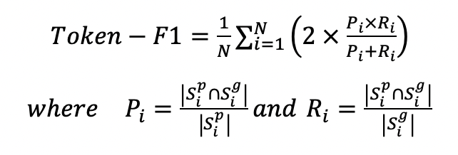
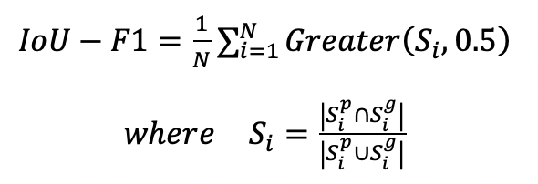
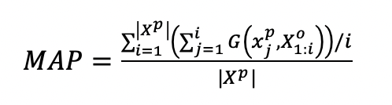
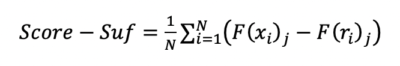
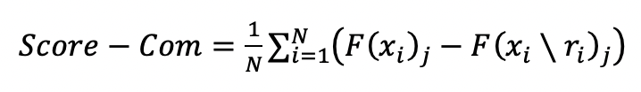

# 可信评测
我们从合理性和忠诚性两个维度对模型进行可解释评估。

<br>

## 合理性
评估模型预测依赖的证据与人工标注证据的拟合度，我们使用token-F1(macro-F1)和set-F1(IoU-F1, Intersection over Union F1)作为评估指标。

具体计算见公式一和公式二：<br>
公式一：
<p align="center">
<br>
</p>

公式二：
<p align="center">
<br>
</p>

其中 S<sub>i</sub><sup>p</sup>和S<sub>i</sub><sup>g</sup>分别代表针对第i条输入模型预测证据和人工标注证据，N代表数据集中数据的数量。<br>

<br><br>

## 忠诚性
评估模型提供证据多大程度上反应了模型预测时真实的推理过程。我们从一致性、充分性和完备性三个维度评估模型的忠诚性。

<br>

### 一致性
一致性评估(原始输入，对应扰动输入)对中词重要度排序的一致性。证据分析方法对输入中每个词赋予一个重要度，基于该重要度对输入中所有词进行排序。我们使用搜索排序中的**MAP**（mean average precision）指标来计算两个排序的一致性。见以下公式：
<br>

公式三：
<p align="center">
<br>
</p>

其中X<sup>o</sup>和X<sup>p</sup>分别代表原始输入和扰动输入的词重要度排序序列。|X<sup>p</sup>|代表X<sup>p</sup>中词的个数，X<sup>o</sup><sub>1:j</sub>表示X<sup>o</sup>中前j最重要的词。函数G(x, Y)检查词x是否存在于列表Y中，如果存在则G(x, Y)=1。MAP越高表示两个序列排序一致性越高

<br>

### 充分性和完备性
**充分性**，即模型给出的证据是否包含了预测需要的全部信息；<br>
**完备性**，即模型对输入x的预测结果。<br>
具体计算方式如下：<br>
公式四(充分性)：
<p align="center">
<br>
</p>
公式五(完备性)：

<p align="center">
<br>
</p>

F(x<sub>i</sub>)<sub>j</sub>表示模型F对于输入x<sub>i</sub>预测为label j的概率，r<sub>i</sub>表示输入x<sub>i</sub>的证据，相应地，x<sub>i</sub>\r<sub>i</sub>表示x<sub>i</sub>的非证据部分，即把r<sub>i</sub>从输出x<sub>i</sub>中去除。充分性得分越低、完备性得分越高，表示证据的忠诚性越高。
<br>


## 代码示例
```python
from trustai.evaluation import Evaluator

evaluator = Evaluator()

# goldens是基于测试数据标注的标准证据
# predicts是基于分析方法获得的预测证据
# 合理性评测，评估模型预测的证据与人工标注证据间的拟合程度，选用token-F1(macro-F1)和set-F1(IoU-F1, Intersection over Union F1)作为评测指标。
macro_f1 = evaluator.cal_f1(goldens, predicts)
iou_f1 = evaluator.calc_iou_f1(goldens, predicts)

# 忠诚性评测，评估模型给出的证据多大程度上影响预测。我们从两大维度评估，对应3个评估指标
# 维度一：从证据的充分性和完备性上评测忠诚性，充分性表明证据包含了做出预测的足够信息，完备性表明证据包含了对预测有影响的所有信息，即非证据部分无法支持预测。
sufficency, comprehensiveness = evaluator.cal_suf_com(goldens, predicts)
# 维度二：扰动下证据的一致性，即相似的输入+相似的输出=相似的证据，如果满足这一点则模型是忠诚的
map_score = evaluator.cal_map(goldens, predicts)
```
更多使用示列详见[examples](../../examples/evaluation/)。
