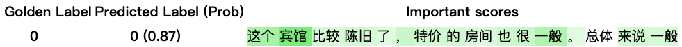

# 特征级证据分析

## 背景介绍
特征级证据分析给出模型预测所依据的来自预测文本的若干重要特征。
本工具提供了3种主流的证据分析方法，分别是LIME、Attention、Integrated Gradient。同时，我们也封装了InterpretDL中的NormLime、GradShap方法。

## 使用示例
初始化待分析模型。
```python
from paddlenlp.transformers import ErnieForSequenceClassification, ErnieTokenizer
model = ErnieForSequenceClassification.from_pretrained('ernie-1.0', num_classes=2)
tokenizer = ErnieTokenizer.from_pretrained('ernie-1.0')
```

准备好要分析数据，将文本转化为开发者模型的输入。
```python
data = [{ "text": '这个宾馆比较陈旧了，特价的房间也很一般。总体来说一般'}]

# preprocess_fn是开发者自定义的预处理函数，将文本转化为模型的输入格式
model_inputs = preprocess_fn(data)
```

初始化分析接口，输入待分析数据。
```python
from trustai.interpretation.token_level import IntGradInterpreter
ig = IntGradInterpreter(model)
result = ig(preprocess_fn(data), steps=100)

# attributions的长度与用户切词相同
# 数值的大小表示对应特征对预测结果支持的程度
print(result[0].attributions)
# [ 0.02149865  0.13750568  0.03729623  0.20981199  0.11474895  0.00191162
#  0.01166647  0.01939347  0.00499799 -0.01771647  0.05467343 -0.05574901
#  0.0797711   0.02094495 -0.02661019  0.01423277  0.03983632  0.05040766
#  0.03474617  0.10548145 -0.02475511 -0.06759283 -0.07004125 -0.0207927
#  0.03771218  0.01511401 -0.01349011  0.01542336]
```


TrustAI支持将输出的重要度分数映射到更大粒度的切分结果上，并进行可视化输出。这里给出了一个基于jieba分词的使用示例。

```python
import jieba

from trustai.interpretation import get_word_offset
# 分析的文本
print(data[0]['text']）
# 这个宾馆比较陈旧了，特价的房间也很一般。总体来说一般

# 由于示例使用的是ernie-1.0模型，若要与attribution对齐，需要在原始文本拼接[CLS], [SEP]
context = "[CLS]" + " " + data[0]['text'] + " " + "[SEP]"
# 开发者自定分词
words = ["[CLS]"] + list(jieba.cut(data[0]['text'])) + ["[SEP]"]
# ['[CLS]', '这个', '宾馆', '比较', '陈旧', '了', '，', '特价', '的', '房间', '也', '很', '一般', '。', '总体', '来说', '一般', '[SEP]']

# 获取用户自定切词的word_offset_map
# word_offset_map表示开发者自定义切词在context中的字符的偏移位置
word_offset_map = get_word_offset(context, words)
# [[0, 5], [6, 8], [8, 10], [10, 12], [12, 14], [14, 15], [15, 16], [16, 18], [18, 19], [19, 21], [21, 22], [22, 23], [23, 25], [25, 26], [26, 28], [28, 30], [30, 32], [33, 38]]

# 计算模型切词offset_map
subword_offset_map = tokenizer.get_offset_mapping(context)
# [(0, 1), (1, 3), (3, 4), (4, 5), (6, 7), (7, 8), (8, 9), (9, 10), (10, 11), (11, 12), (12, 13), (13, 14), (14, 15), (15, 16), (16, 17), (17, 18), (18, 19), (19, 20), (20, 21), (21, 22), (22, 23), (23, 24), (24, 25), (25, 26), (26, 27), (27, 28), (28, 29), (29, 30), (30, 31), (31, 32), (33, 34), (34, 37), (37, 38)]

# 将attributions对齐到words
aligns = ig.alignment(result, [context], [batch_words], [word_offset_map], [subword_offset_map], special_tokens=["[CLS]", '[SEP]'])

print(aligns[0].words)
# ['[CLS]', '这个', '宾馆', '比较', '陈旧', '了', '，', '特价', '的', '房间', '也', '很', '一般', '。', '总体', '来说', '一般', '[SEP]']
print(aligns[0].word_attributions)
# [0.021498650312423706, 0.17480190843343735, 0.3245609328150749, 0.013578088022768497, 0.02439146302640438, -0.01771647110581398, 0.05467343330383301, 0.024022094905376434, 0.020944949239492416, -0.012377424165606499, 0.03983632102608681, 0.05040765926241875, 0.14022761583328247, -0.024755112826824188, -0.13763408362865448, 0.01691947504878044, 0.001623895950615406, 0.015423357486724854]
print(aligns[0].pred_label)
# 0
print(aligns[0].pred_proba)
# [0.86797816 0.1320218 ]
print(aligns[0].rationale)
# (1, 2, 6, 11, 12)
print(aligns[0].rationale_tokens)
# ('这个', '宾馆', '，', '很', '一般')
print(aligns[0].non_rationale)
# (3, 4, 5, 7, 8, 9, 10, 13, 14, 15, 16)
print(aligns[0].non_rationale_tokens)
# ('比较', '陈旧', '了', '特价', '的', '房间', '也', '。', '总体', '来说', '一般')

```

可视化示例
```python
# html为HTML格式的文本，可以保存为html文件
html = visualize_text(VisualizationTextRecord(aligns[0], true_label=0))
```
<p align="center">
<br>
图1 可视化实例：实例来自情感分析任务
</p>

详细示例见[examples](../../../examples/interpretation/token_level)。
