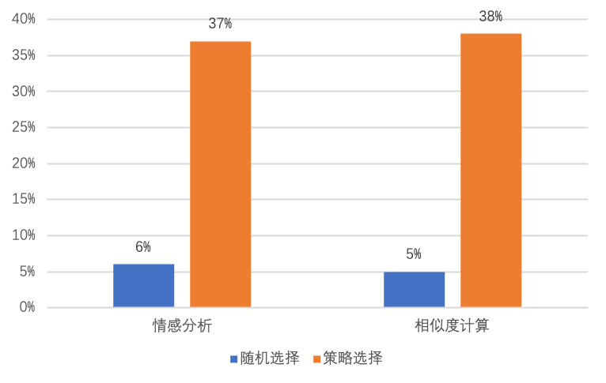
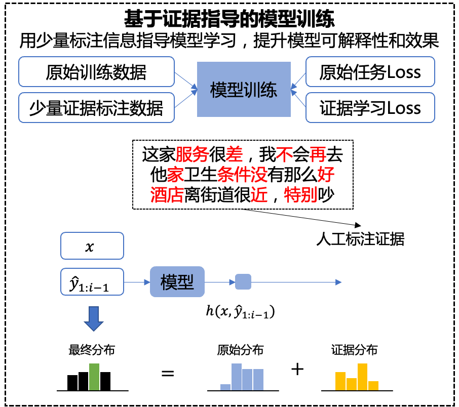

# 可信增强
TrustAI提供基于证据分析的模型增强方案，该目录包含通用的增强方法，以及针对具体任务的一些有效方案，希望这些方案能够帮助开发者对其任务模型进行增强。

* [解决训练数据覆盖不足的问题](#解决训练数据覆盖不足的问题)
* [解决训练数据存在脏数据的问题](#解决训练数据存在脏数据的问题)
* [解决训练数据分布偏置的问题](#解决训练数据分布偏置的问题)
    * [数据权重修正](#数据权重修正)
    * [数据分布修正](#数据分布修正)
* [基于证据指导的模型训练增强方案](#基于证据指导的模型训练增强方案)
* [证据分析用于相似度计算任务](#证据分析用于相似度计算任务)

## 解决训练数据覆盖不足的问题
### 方法介绍
训练数据覆盖不足会导致模型在对应的测试数据上表现不好。数据扩充是提升模型效果直接的方法，然而数据标注是一个费时费力的工作，如何标注更少的数据带来更大的效果提升是大多数NLP开发者面临的难题。

TrustAI可识别因训练数据覆盖不足而导致的预测效果差的测试样本（这些样本构成的集合称为目标集），并能帮助开发者从未标注数据中选择有效数据进行标注，提高训练数据对目标集的覆盖度，进而提升模型效果。

### 方法效果

由于标注数据成本高昂，本方案基于相似度计算任务开源数据集LCQMC的部分数据上进行模拟实验，在LCQMC的测试集和DuQM鲁棒性数据集上评估效果。实验基于ERNIE-3.0-base-zh微调，评估指标为准确率。

由下表可知，通过增加20%的训练数据，该方案在目标集上效果提升14.40%（随机选择同等规模数据加入后提升0.01%），同时在整个测试集上，该方案将效果提升1.03%（随机选择方案提升0.06%）。

|   数据集         | 数据量      |  LCQMCdev  | LCQMCtest  | DuQM | 目标集 |
| :-------:       | :-------:  | :-----: | :-----: |:-----: |:-----: |
| 基线             | 5000       | 86.42%  | 84.49% | 69.17%  | 55.19% |  
| 基线 + 随机1000条 | 6000       | 86.76%  | 85.05% | 69.23%  | 55.20% |
| 基线 + 策略1000条 | 6000       | 87.04%  | 85.58% | 70.20%  | 69.60% |

应用的详细示例见[解决训练数据覆盖不足的问题](./sparse_data_identification/README.md)。

 

## 解决训练数据存在脏数据的问题
### 方法介绍
训练数据标注质量对模型效果有较大影响，往往会成为模型效果提升的瓶颈。但当标注数据规模较大时，数据检查就成为一个难题。

TrustAI提供了脏数据（即标注质量差的数据）自动识别功能，帮助降低人工检查数据的成本。如下图所示，在两个公开数据集上，TrustAI自动识别的脏数据比例远高于随机选择策略。

 
图1 不同策略识别出的脏数据比例

### 方法效果

由于标注数据成本高昂，本方案基于相似度计算任务开源数据集LCQMC的部分数据上进行实验，在LCQMC的测试集和DuQM鲁棒性数据集上评估效果。实验基于ERNIE-3.0-base-zh微调，评估指标为准确率。

由下表可知，对候选脏数据进行人工检查及修正（规模为原始训练集的10%），模型在LCQMC测试集上提升2.13%，在相似度匹配鲁棒性数据集（DuQM）上提升4.01。

|   数据集  |   LCQMCdev  | LCQMCtest | DuQM |
| :-------:  | :-----: | :-----: |:-----: |
| 基线   |  86.42%  | 84.49% | 69.17%  |  
| 数据修正   | 87.76%  | 86.62% | 73.18%  |  

应用的详细示例见[解决训练数据存在脏数据的问题](./dirty_data_identification/README.md)。

 

## 解决训练数据分布偏置的问题
### 方法介绍
研究表明，神经网络模型会利用数据集中的偏置作为预测的捷径，如在情感分析任务中，遇到否定词模型会倾向预测为“负向”情感。这种偏置会导致模型没有真正理解语言，导致模型的鲁棒性降低。

TrustAI提供了数据权重修正和数据分布修正两种优化策略，在不需要人工介入的条件下，缓解训练数据偏置对模型训练的影响，提升模型的语义理解能力，进而提升模型的鲁棒性。

### 数据权重修正
数据权重修正通过降低偏置样本对训练loss的影响减少模型从偏置样本中学习，即在训练loss计算时引入样本的偏置度(详见[Du, Yanrui, et al. 2022](https://arxiv.org/abs/2205.12593))。当前方案提供了`lls_d`和`lls_d_f`两种计算样本偏置度的策略，前者考虑了词的有偏性，而后者同时考虑词的有偏性和频次。

#### 方法效果
本方案基于相似度计算任务开源数据集LCQMC训练模型，在LCQMC的测试集和DuQM鲁棒性数据集上评估效果。实验基于ERNIE-3.0-base-zh微调，评估指标为准确率。

由下表可知，相比基线效果，在鲁棒性数据集DuQM上准确率最高提升0.94%。

|   数据集  |  LCQMCdev  | LCQMCtest  |   DuQM  |  
| :-------:  | :-------:  | :-------:  | :-------:  |
| 基线   | 90.93% | 87.06% | 73.82% |  
| lls_d  | 90.76% | 87.58% | 74.76% |  
| lls_d_f  |  90.80% | 87.22% | 74.44% |  

应用的详细示例见[数据权重修正](./data_bias_identification/less_learn_shortcut/README.md)。

 

### 数据分布修正
数据分布修正通过对非偏置数据多次重复采样，使训练数据分布尽量均衡。该方案通过可信分析方法识别训练数据中对模型预测其重要贡献的证据，然后通过分析训练中标签和证据的分布识别偏置样本，对偏置样本重复采样来达到数据均衡的目的。

#### 方法效果

本方案在情感分析数据集ChnsentiCorp上进行实验，在情感分析鲁棒性数据集上评估效果。实验基于ERNIE-3.0-base-zh微调，评估指标为准确率。

由下表可知，相比基线效果，在鲁棒性数据集上准确率提升1.41%。
|   数据集  | 鲁棒性数据集  |  
| :-------:  | :-------:  |
| 基线   |   69.97 |  
| 分布修正   |   71.38 |

应用的详细示例见[数据分布修正](./data_bias_identification/data_distribution_correction/README.md)。

 

## 基于证据指导的模型训练增强方案
### 方法介绍
通过当前可信分析结果，即模型预测依赖证据的分析，发现现有NN模型提供的证据合理性偏弱。为进一步提高证据的合理性，TrustAI提供了基于证据指导的模型训练增强的方法，即标注少量证据数据，通过联合学习原始任务和证据学习任务，提升模型的可解释性。

参照MAW(Mean attention weights, [Jayaram etc. 2021](https://aclanthology.org/2021.emnlp-main.450/))方法，我们利用专家标注的证据指导模型的优化。

 

### 方法效果

我们使用标注了证据的英文情感分析数据集验证方案效果(训练集1000条，验验证集500条)。

实验基于ERNIE-2.0-EN-Base微调，效果评估指标为准确率，可解释性评估指标为合理性、充分性和完备性。

由下表可知，在引入MAW loss后，模型效果和可解释性都有明显提升，准确率提升0.5%，同时模型的合理性（+5.0%）、充分性（-0.185）和完备性（+0.044）获得一致改善。

|   数据集   | 准确率   | 合理性 | 充分性 | 完备性 |
| :-------:  | :-----: | :-----: | :-----: | :-----: |
| base   | 93.5% | 26.1% | 0.367 | 0.118 |
| base + maw loss | 94.0% | 31.1% | 0.182 | 0.162 |

应用的详细示例见[基于证据指导的模型训练增强方案](./enhanced_by_rationale/README.md)。

 

## 证据分析用于相似度计算任务
### 方法介绍
在相似度计算中，我们基于证据分析结果识别模型预测困难数据，针对困难数据生成强正负例，然后通过数据增强方法提升模型的效果。首先，如何用证据分析结果识别困难数据呢？

我们依赖证据一致性评估指标MAP，该指标评估句对中词重要度排序的一致性。若两个句子语义相似，则它们的证据一致性也较高。基于该假设，我们认为模型判断为相似但MAP指标低的句对，可能是潜在预测错误数据。基于此规则对模型预测数据进行过滤，就可以获得大量模型处理不好的数据，通过对这类数据的人工标注，以及加入训练数据，可以提升模型在这类数据上的效果。通过证据分析识别困难数据，有效识别应该标注的训练数据，降低标注成本，提升模型鲁棒性。

### 方法效果

我们使用LCQMC数据集做了实验验证。其中，相似度计算模型是基于ERNIE-1.0-base微调，MAP指标阈值设为0.3，识别出3.4%困难数据，相比于模型在全量数据上效果，模型在该类数据上效果下降了9.67%。

|   数据集   | acc    |
| :-------:  | :-----: |
| 全部数据   | 89.53% |
| 困难数据 | 79.86% |

基于困难数据，自动生成强正负例，通过数据增强方式重训模型，模型在该类数据上准确率提升7%。

应用的详细示例见[examples](../examples/application/zh-similarity-application.ipynb)。
