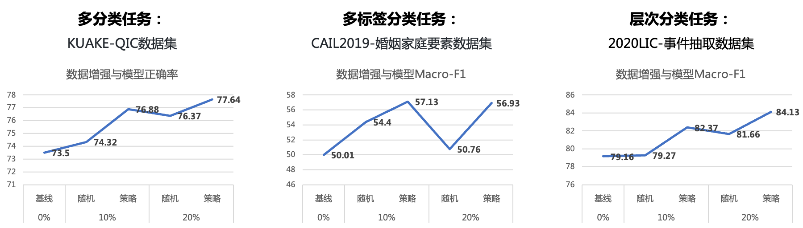
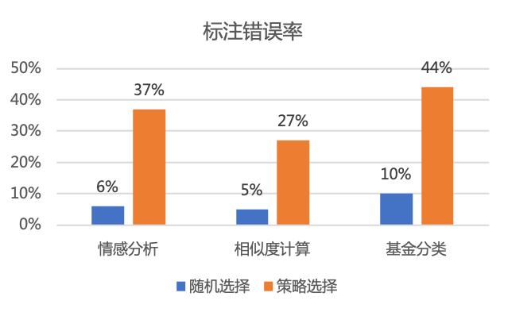
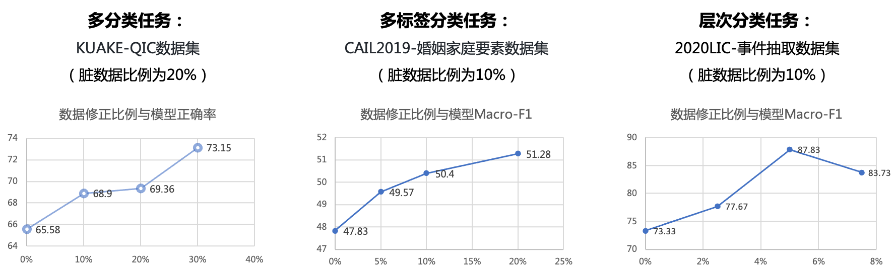

# 应用案例
基于对模型预测依赖证据的分析，TrustAI提供了模型缺陷识别方案及对应的优化方案。在该目录，我们通过具体实例介绍几种方案，一是希望开发者可直接利用这些方案对其任务模型进行优化，二是希望启发研究者探索证据分析的更多价值。
* 训练数据缺陷识别及针对性优化策略
    * [训练数据覆盖不足识别及有效数据增强](#训练数据覆盖不足识别及有效数据增强)
    * [训练数据中脏数据识别及标注修正](#训练数据中脏数据识别及标注修正)
    * [训练数据分布偏置识别及偏置消除](#训练数据偏置识别及偏置消除)
        * [数据权重修正](#数据权重修正)
        * [数据分布修正](#数据分布修正)
* 基于证据指导的预测机制优化
   * [证据识别及基于证据的预测](#证据识别及基于证据的预测)

同样地，我们也探索了证据分析的其他价值，如：
* [基于证据指导的模型增强方案](#基于证据指导的模型增强方案) 
* [基于证据指导的预测错误数据识别](#基于证据指导的预测错误数据识别)

## 训练数据覆盖不足识别及有效数据增强
### 方法介绍
训练数据覆盖不足会导致模型在对应的测试数据上表现不好。数据扩充是提升模型效果首选方法，然而数据标注是一个费时费力的工作，如何标注更少的数据带来更大的效果提升是大多数NLP开发者面临的难题。

TrustAI可识别因训练数据覆盖不足而导致的预测效果差的测试样本（这些样本构成的集合称为目标集），并能帮助开发者从未标注数据中选择有效数据进行标注，提高训练数据对目标集的覆盖度，进而提升模型效果。

### 方法效果

由于标注数据成本高昂，下表给出了基于相似度计算任务LCQMC数据集进行的模拟实验效果。实验基于ERNIE-3.0-base-zh在LCQMC训练数据上微调得到模型，在LCQMC测试集和DuQM鲁棒性数据集上进行效果评估，评估指标为准确率。

|   数据集         | 数据量      |  LCQMCdev  | LCQMCtest  | DuQM | 目标集 |
| :-------:       | :-------:  | :-----: | :-----: |:-----: |:-----: |
| 基线             | 5000       | 86.42%  | 84.49% | 69.17%  | 55.19% |  
| 基线 + 随机1000条 | 6000       | 86.76%  | 85.05% | 69.23%  | 55.20% |
| 基线 + 策略1000条 | 6000       | 87.04%  | 85.58% | 70.20%  | 69.60% |

实验结论：增加20%有效训练数据，该方案将目标集效果提升14.40%（随机选择同等规模数据加入训练数据，效果仅提升0.01%）；同时在整个测试集上，该方案将效果提升1.03%（随机选择方案仅提升0.06%）。

同时，该策略接入了PaddleNLP的分类系统，在多分类、多标签分类、及层次分类任务上完成了效果验证，效果如图1所示：通过TrustAI提供的有效数据选择策略，增加10%训练数据带来的效果提升大于随机增加20%训练数据的效果，也就是说，该策略能够**节省一半标注成本**。

 
图1 在三个常见分类任务上应用“数据覆盖不足识别及有效数据增强”策略的效果

详细方案和实验介绍见应用示例[训练数据覆盖不足识别及有效数据增强](./sparse_data_identification)。
 

## 训练数据中脏数据识别及标注修正
### 方法介绍
训练数据标注质量对模型效果有较大影响，往往会成为模型效果提升的瓶颈。但当标注数据规模较大时，数据检查就成为一个难题。

TrustAI提供了脏数据（即标注质量差的数据）自动识别功能，降低人工检查数据成本。如图2所示，在三个公开数据集上，TrustAI提供的脏数据识别策略，其识别的脏数据比例远高于随机选择策略。

 
图2 在3个数据集上，不同策略识别的脏数据效果

### 方法效果

下表给出了基于相似度计算任务LCQMC数据集上进行的实验效果。实验基于ERNIE-3.0-base-zh在LCQMC训练数据上微调得到模型，并在LCQMC测试集和DuQM鲁棒性数据集上评估效果，评估指标为准确率。

|   数据集  |   LCQMCdev  | LCQMCtest | DuQM |
| :-------:  | :-----: | :-----: |:-----: |
| 基线   |  86.42%  | 84.49% | 69.17%  |  
| 数据修正   | 87.76%  | 86.62% | 73.18%  |  

结果说明：对候选脏数据（规模为原始训练集的10%）进行人工标注修正，数据修正后重新训练模型，在LCQMC测试集上效果提升2.13%，在DuQM数据集上效果提升4.01%。

同时，该策略接入了PaddleNLP的分类系统，在多分类、多标签分类、及层次分类任务上完成了效果验证，效果如图3所示。

 
图3 在三个常见分类任务上应用“脏数据识别及标注修正”策略的效果

详细方案和实验介绍见应用示例[训练数据中脏数据识别](./dirty_data_identification)。

 

## 训练数据偏置识别及偏置消除
### 方法介绍
研究表明，神经网络模型会利用数据集中的偏置作为预测捷径，如在情感分析任务中，遇到否定词模型会倾向预测为“负向”情感。这种偏置会导致模型没有真正理解语言，导致模型的鲁棒性降低。

TrustAI提供了数据权重修正和数据分布修正两种优化策略，在不需要人工介入的条件下，缓解训练数据偏置对模型训练的影响，提升模型的语义理解能力，进而提升模型的鲁棒性。
* 数据权重修正：降低偏置样本对训练loss的影响，即减少模型从偏置样本中学习。具体方案详见[Du, Yanrui, et al. 2022](https://arxiv.org/abs/2205.12593)，其提供了`lls_d`和`lls_d_f`两种样本偏置度计算策略，前者考虑了词的有偏性，而后者同时考虑词的有偏性和频次。
* 数据分布修正：通过对非偏置数据多次重复采样，使训练数据分布尽量均衡。

### 方法效果 - 数据权重修正

实验基于ERNIE-3.0-base-zh在相似度计算任务LCQMC数据集上微调得到基线模型，在LCQMC测试集和DuQM鲁棒性数据集上评估效果，评估指标为准确率。

效果如下表所示：相比于基线，数据权重修正后，模型在鲁棒性数据集DuQM上准确率提升0.94%。

|   数据集  |  LCQMCdev  | LCQMCtest  |   DuQM  |  
| :-------:  | :-------:  | :-------:  | :-------:  |
| 基线   | 90.93% | 87.06% | 73.82% |  
| lls_d  | 90.76% | 87.58% | 74.76% |  
| lls_d_f  |  90.80% | 87.22% | 74.44% |  

详细见应用示例[数据权重修正](./data_bias_identification/data_distribution_correction)。

 

### 方法效果 - 数据分布修正

实验基于ERNIE-3.0-base-zh在情感分析任务ChnsentiCorp数据集上微调得到基线模型，在情感分析鲁棒性数据集上评估效果，评估指标为准确率。

效果如下表所示：相比于基线，数据分布修正后，模型在鲁棒性数据集上准确率提升1.41%。
|   数据集  | 鲁棒性数据集  |  
| :-------:  | :-------:  |
| 基线   |   69.97 |  
| 分布修正   |   71.38 |

详细见应用示例[数据分布修正](./data_bias_identification/data_distribution_correction)。

 

## 证据识别及基于证据的预测

### 方法介绍

在长文本理解问题上，输入中的冗余信息往往会干扰模型预测，导致模型鲁棒性差。如在机器阅读理解(MRC)任务中，模型容易受到输入中扰动信息干扰，即输入中加入一些与答案生成无关的信息，模型生成的答案却可能发生改变。

为了降低模型受无关信息干扰带来的影响，TrustAI构建“证据识别-基于证据的预测”二阶段流程。首先，通过证据抽取识别输入中有效信息，排除冗余数据；然后基于识别的有效信息进行最终答案生成，提高模型鲁棒性。

### 方法效果
我们在MRC任务上做了验证，基于ERNIE-3.0-base-zh在DuReader-robust训练数据上微调了基线模型，在DuReader-robust的验证集合、测试集合和Challenge Test（DuReader-chechlist）集合上做了效果验证评估，评估指标为答案的EM（exactly match）。

|        模型        | DuReader-robust dev EM | DuReader-robust Test EM | **DuReader-checklist dev EM** |
| :----------------: | ---------------------- | ----------------------- | :---------------------------: |
|    roberta-base    | 73.18                  | 45.97                  |             27.56             |
| Selector-Predictor | 74.31                  | 50.91                  |             31.04             |

实验结论：“证据识别-基于证据的预测”二阶段方案，将模型在测试集上的效果提升4.94%，同时将训练的模型直接在DuReader Checklist数据集评估，相较于官方基线汇报结果，EM提升3.48%。

详细见应用示例[解决文本冗余导致精度下降的问题](./redundancy_removal)。

## 基于证据指导的模型增强方案
### 方法介绍
经过对多个模型预测依赖证据的评估，发现NN模型提供证据的合理性偏弱。为进一步提高证据的合理性，TrustAI提供了基于证据指导的模型增强方案（[Jayaram etc. 2021](https://aclanthology.org/2021.emnlp-main.450/)），即标注少量证据数据，通过联合学习原始任务和证据学习任务，用证据学习目标指导模型依赖合理的证据进行预测，提升模型可解释性。

 

### 方法效果

实验基于ERNIE-2.0-EN-Base在英文情感分析SST数据集上微调得到基线模型，然后选择1000条训练数据进行证据标注，在这些数据上进行证据学习。最终，在500条标有证据的验证数据上进行了效果评估。评估指标除了模型预测准确率外，还包括可解释评估指标，即证据的合理性、充分性和完备性。

实验结果如下表：在加入证据指导后，模型预测效果略有提升，准确率提升0.5%；模型可解释性提升明显：证据合理性提升5.0%、充分性降低0.185（该指标越低越好）、完备性提升0.044。

|   数据集   | 准确率   | 合理性 | 充分性 | 完备性 |
| :-------:  | :-----: | :-----: | :-----: | :-----: |
| base   | 93.5% | 26.1% | 0.367 | 0.118 |
| base + maw loss | 94.0% | 31.1% | 0.182 | 0.162 |

应用的详细示例见[基于证据指导的模型增强方案](./enhanced_by_rationale)。

 

## 基于证据指导的预测错误数据识别
### 方法介绍
TrustAI可信分析方法提供了模型预测依赖的证据，用来解释模型为什么会做这个预测。当预测依赖证据合理性弱，是否说明预测结果不可信呢？基于这个假设，我们做了一些探索，发现可以基于对模型预测依赖证据的分析，识别潜在预测错误的数据。

### 方法效果
实验基于ERNIE-1.0-base在相似度计算任务LCQMC数据集上微调得到相似度计算模型，然后在LCQMC验证集合上进行预测，并利用TrustAI提供的特征级证据分析方法识别模型预测依赖证据。

在我们的实验中，选择模型判断为语义相似但MAP（评估两个输入文本证据的一致性）低于指定阈值（0.3）的数据，其占全部测试数据比例为3.4%。相比于全量测试数据，模型在该类数据上效果下降了9.67%。

|   数据集   | acc    |
| :-------:  | :-----: |
| 全部数据   | 89.53% |
| 候选预测错误数据 | 79.86% |

基于候选预测错误数据，通过数据自动增强方法生成相关数据，作为强正负例加入到原始训练数据中，重训模型后，模型在该类数据上准确率提升7%。

详细见应用示例[相似度计算任务的预测错误数据识别](./map_analysis/zh-similarity-application.ipynb)。

 

