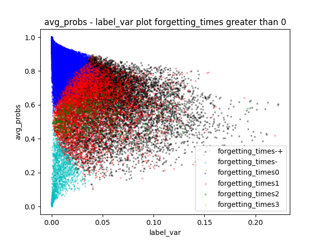

# 基于训练数据动态学习的数据地图绘制

## 方法介绍
现有工作表明, 神经网络的学习动态(learning dynamics)可以帮助数据分析师们更好的了解他们的训练数据, 如难学数据、标注错误数据等, 而这些学习动态可以通过收集数据在训练过程中的各种信号得到.

<p align="center">
<br>
图1 数据地图绘制流程
</p>

TrustAI提供了"训练信号收集 -> 数据地图绘制"方案, 如图1所示. 首先, 在训练过程中针对每条训练数据统计其在不同step下的训练信号; 然后, 根据整理的训练信号, 根据指定的信号维度绘制数据地图.

注：开发者可访问[ AI Studio示例 ](https://aistudio.baidu.com/aistudio/projectdetail/5307701)快速体验本案例。

## 实验步骤
我们以基于相似度计算任务LCQMC数据集上的模拟实验为例, 介绍该方案实现步骤和效果.


**Step 1**: 从LCQMC训练集中随机抽取100条数据作为新训练集. 基于ERNIE-3.0-base-zh在新训练集`sample_100.tsv`微调得到基线模型, 运行命令如下所示:

```shell
# 训练模型并收集训练信号
sh run_train_pointwise.sh
```
所有训练数据的训练信号保存在`outputs`路径下.

注:
1. 训练信号的收集代码可参考代码`train_pointwise.py`中Lines 199-218, 针对用户自己的模型自行进行修改.
2. 训练信号的收集, 即模型训练代码仅作参考. 绘制数据地图仅需按照固定的数据结构将训练信号进行整理即可. 数据结构如下:

```shell
# .jsonl 格式数据
[
    {'id' : xxx,                // 训练数据的id
     'label' : xxx,             // 训练数据对应的label
     'pred_label' : xxx,        // 训练数据的预测label
     'noisy_label' : xxx,       // 训练数据是否为构造脏数据
     'correct' : xxx,           // 训练数据是否被预测正确
     'loss' : xxx,              // 训练数据当前的loss
     'probs' : [xxx, xxx],      // 训练数据在当前每个类下的预测概率(one-hot形式)
     'label_probs' : xxx        // 训练数据在label类别下的预测概率
     }  
    ... ...
]
```

**Step 2**：训练信号处理
将训练过程中收集到的训练信号进行处理, 生成针对每条数据的具体训练信号.

```shell
# 训练信号处理
python -u sample_stat_summary.py
```
产出数据为tsv格式, 保存在`outputs`路径下.
```shell
# tsv 格式数据, 每条训练数据的所有训练信号保存为一行, 每列分别表示:
[
    "id" : xxx,                  // 训练数据的id
    "label" : xxx,               // 训练数据对应的label
    "s_label" : xxx,             // 训练数据的构造label, 数据地图绘制允许标记困难数据(s_label = 1)和构造脏数据(s_label = 2)
    "correct_times" : xxx,       // 总共预测正确的次数  
    "correct_ratio" : xxx,       // 预测正确次数占比
    "avg_probs" : xxx,           // 多次预测的置信度的平均数
    "label_var" : xxx,           // 多次预测的置信度的方差
    "max_label_probs" : xxx,     // 多次预测的置信度的最大值
    "min_label_probs" : xxx,     // 多次预测的置信度的最小值
    "forgetting_times" : xxx,    // 多次预测反映出的，模型对本数据的遗忘次数（之前预测对了，后来又错了）
    "learnt_times" : xxx,        // 多次预测反映出的，模型对本数据的学会次数（之前预测错了，后来又对了）
    "first_forget" : xxx,        // 多次预测中，第一次遗忘本数据  
    "first_learn" : xxx,         // 多次预测中，第一次学会本数据  
]

```
注: 用户可根据此结构自行设计更多的训练信号, 用tab分隔即可.

**Step 3**：基于产出的训练信号, 选择两个信号作为数据地图的两个维度, 进行地图绘制.

```shell
# 数据地图绘制
python -u plot_map.py

# 参数选择
criterion: str类型, 默认值False, 选择一个训练信号作为数据筛选依据, 仅满足条件的数据会被绘制在地图上
threshold: float类型, 默认值0, 与criterion一同使用, 为选择的训练信号设置阈值, 筛选数据
use_f_times: float类型, 默认值-1, 使用forgetting_times并选择所有遗忘次数不小于use_f_times的样本
use_l_times: float类型, 默认值-1, 使用learnt_times并选择所有遗忘次数不小于use_l_times的样本
```

<p align="center">


<br>
图2 数据地图样例. 左: 无参数设置的数据地图; 中: 指定criterion为forgetting_times>=1的数据绘制地图; 右: 使用forgetting_times(use_f_times)区分数据的颜色, 其中左上和左下角数据分别使用correct_times做进一步区分.
</p>
