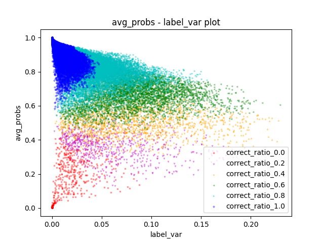
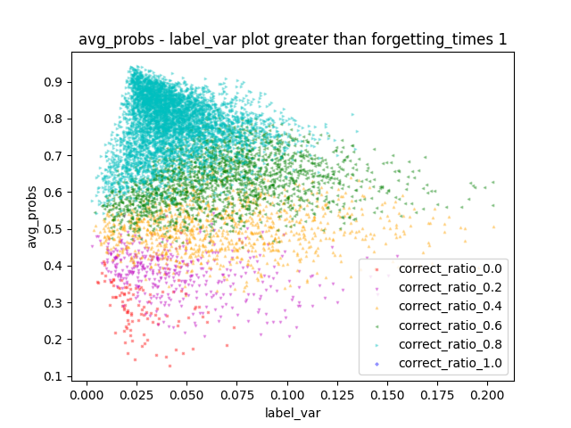
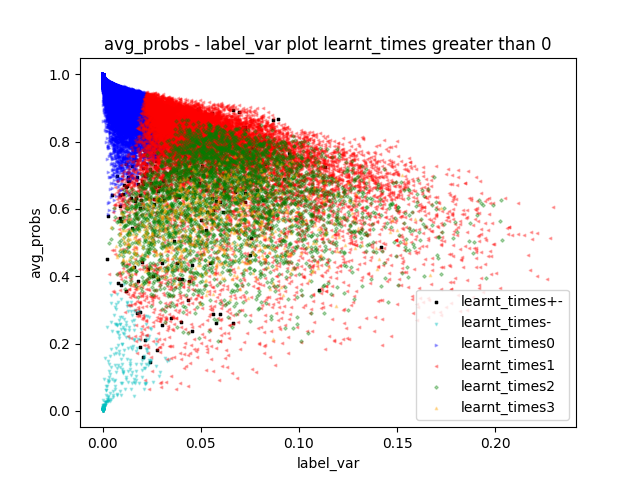

# 基于训练信号的数据地图绘制 Training signal-based data map plotting

## 方法介绍
现有工作表明，可以使用训练数据在训练过程中的信号绘制数据地图；同时，根据信号特征划的区域具有不同特点，如难学、标注错误等。通过绘制数据地图，可以帮助开发者更好地了解训练数据。

TrustAI提供了"训练信号收集 -> 数据地图绘制"方案。首先，在训练过程中针对每条训练数据统计其在不同step下的训练信号；然后，根据整理的训练信号，根据指定的信号维度绘制数据地图。

注：开发者可访问[ AI Studio示例 ](https://aistudio.baidu.com/aistudio/projectdetail/5307701)快速体验本案例。

## 实验步骤
我们以基于相似度计算任务LCQMC数据集上的模拟实验为例，介绍该方案实现步骤和效果。


**Step 1**: 从LCQMC训练集中随机抽取100条数据作为样例训练集. 训练集为.tsv格式, 内容如下

```shell
# tsv格式数据, 每条训练数据为一行, 中间用tab分隔, 每列分别表示:
[
    "text_a" : xxx,              // 训练数据文本a
    "text_b" : xxx,              // 训练数据文本b
    "label" : xxx,               // 训练数据对应的label
    "s_label" : xxx,             // 训练数据的构造label （可省略）
]
```
注:
1. ``s_label``为构造label，允许用户进行构造，如构造脏数据等。训练数据中开发者可以选择使用此列或不使用此列。
2. 案例中提供100条数据（在原始数据集中随机选取）作为开发样例的训练数据。

基于ERNIE-3.0-base-zh在新训练集`sample_100.tsv`微调得到基线模型，运行命令如下所示：

```shell
# 训练模型并收集训练信号
sh run_train_pointwise.sh
```
所有训练数据的训练信号按训练step保存在`outputs`路径下。

注:
1. 训练信号的收集代码可参考代码`train_pointwise.py`中Lines 199-218，针对用户自己的模型自行进行修改。
2. 训练信号的收集，即模型训练代码仅作参考。绘制数据地图仅需按照固定的数据结构将训练信号进行整理即可。数据结构如下：

```shell
# .jsonl 格式数据
[
    {'id' : xxx,                // 训练数据的id
     'label' : xxx,             // 训练数据对应的label
     'pred_label' : xxx,        // 训练数据的预测label
     'correct' : xxx,           // 训练数据是否被预测正确
     'loss' : xxx,              // 训练数据当前的loss
     'probs' : [xxx, xxx],      // 训练数据在当前每个类下的预测概率(one-hot形式)
     'label_probs' : xxx        // 训练数据在label类别下的预测概率
     }  
    ... ...
]
```

**Step 2**：训练信号处理：将不同训练steps收集到的信号进行处理，生成基于每条训练数据的信号。

```shell
# 训练信号处理
python -u sample_stat_summary.py
```
产出数据保存在`outputs`路径下。

<details>
    <summary> 训练信号详细信息 </summary>

```shell
# tsv 格式数据, 每条训练数据的所有训练信号保存为一行, 信号之间用tab进行分隔, 每列分别表示:
[
    "id" : xxx,                  // 训练数据的id
    "label" : xxx,               // 训练数据对应的label
    "s_label" : xxx,             // 训练数据的构造label, 数据地图绘制允许标记困难数据(s_label = 1)和构造脏数据(s_label = 2)
    "correct_times" : xxx,       // 总共预测正确的次数  
    "correct_ratio" : xxx,       // 预测正确次数占比
    "avg_probs" : xxx,           // 多次预测的置信度的平均数
    "label_var" : xxx,           // 多次预测的置信度的方差
    "max_label_probs" : xxx,     // 多次预测的置信度的最大值
    "min_label_probs" : xxx,     // 多次预测的置信度的最小值
    "forgetting_times" : xxx,    // 多次预测反映出的，模型对本数据的遗忘次数（之前预测对了，后来又错了）
    "learnt_times" : xxx,        // 多次预测反映出的，模型对本数据的学会次数（之前预测错了，后来又对了）
    "first_forget" : xxx,        // 多次预测中，第一次遗忘本数据  
    "first_learn" : xxx,         // 多次预测中，第一次学会本数据  
]
```
</details>

**Step 3**：基于产出的训练信号，选择两个信号作为数据地图的两个维度（默认为平均置信度与置信方差），并选择其他信号（如正确比例、正确次数、遗忘次数、学习次数等）以颜色、符号等进行区别并进行地图绘制。

```shell
# 数据地图绘制
python -u plot_map.py

# 参数选择
attr1: str类型， 默认值为"avg_probs", 选择一个信号作为数据地图的纵轴
attr2: str类型， 默认值为"label_var", 选择一个信号作为数据地图的横轴
criterion: str类型, 默认值为空, 选择一个训练信号作为数据筛选依据, 仅满足条件的数据会被绘制在地图上
threshold: float类型, 默认值0, 与criterion一同使用, 为选择的训练信号设置阈值, 筛选数据
use_f_times: float类型, 默认值-1, 使用forgotten_times并选择所有遗忘次数不小于use_f_times的样本
use_l_times: float类型, 默认值-1, 使用learnt_times并选择所有遗忘次数不小于use_l_times的样本

# 数据地图样例
python -u plot_map.py                                               # 图1左
python -u plot_map.py --criterion forgetting_times --threshold 1    # 图1中
python -u plot_map.py --use_l_times 0                               # 图1右
```

<p align="center">


<br>
图1 数据地图样例。左: 默认参数设置的数据地图；中：指定criterion为forgetting_times，threshold为1的数据绘制地图；右：使用learnt_times(use_l_times=0)区分数据的颜色，其中左上和左下角数据分别使用correct_times做进一步区分。此数据地图根据全量LCQMC数据的训练信号绘制，而非提供的100条样例。
</p>
