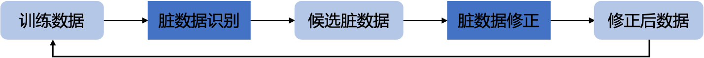

# 训练数据中脏数据识别

### 方法介绍
训练数据标注质量对模型效果有较大影响，但受限于标注人员水平、标注任务难易程度等影响，训练数据中都存在一定比例的标注错误的数据（称为**脏数据**）。当标注数据规模较大时，数据标注检查就成为一个难题。

<p align="center">
<br>
图1 脏数据识别及标注修正策略流程
</p>

TrustAI提供了"脏数据识别 -> 修正"方案，如图1所示。首先，基于实例级证据分析方法识别候选脏数据（对模型训练影响较大的数据）。然后，对候选脏数据进行标注修正，使用修正后的数据重新训练模型，可显著提升模型效果。

注：开发者可访问[ AI Studio示例 ](https://aistudio.baidu.com/aistudio/projectdetail/4434058)快速体验本案例。

## 实验步骤
我们以基于相似度计算任务LCQMC数据集上的模拟实验为例，介绍该方案实现步骤和效果。


**Step 1**：从LCQMC训练集中随机抽取5000条数据作为新训练集。基于ERNIE-3.0-base-zh在新训练集`train_5000.tsv`微调得到基线模型，运行命令如下所示：

```shell
# 下载数据
wget --no-check-certificate https://trustai.bj.bcebos.com/application_data/dirty_data.tar && tar xf dirty_data.tar && rm dirty_data.tar
# 训练基线模型
python -u train.py --dataset_dir ./data --train_file train_5000.tsv --dev_file dev.tsv --test_files test.tsv --num_classes 2 --save_dir ./checkpoint
```
训练的基线模型保存在`checkpoint`路径下。


**Step 2**：识别训练集中的脏数据。
脏数据选择方法：基于TrustAI提供的实例级可信分析方法`RepresenterPointModel`，计算每一条训练样本对模型loss的影响分数，一般该分数表明了样本作为脏数据的可能性。我们使用这个分数识别脏数据。

```shell
# 从训练集中识别候选脏数据
python -u find_dirty_data.py --dataset_dir ./data --train_file train_5000.tsv  --num_classes 2  --rest_path ./data/rest_train.tsv --init_from_ckpt ./checkpoint/model_state.pdparams  --dirty_path ./data/dirty_train.tsv --dirty_num 500
# dirty_num表示选取候选脏数据的数量
# dirty_path表示候选脏数据的存储路径
```


**Step 3**：对候选脏数据（在我们的实验中，其占比为全部训练集10%）进行标注修正，修正后的数据保存在`correction_data.tsv`（数据修正比例为**38.4%**，随机选择数据其需要修正的数据比例为**5.0%**）。


**Step 4**：使用修正后的新训练集`train_5000_correction.tsv`重新训练模型，并评估模型效果。
```shell
# 下载数据：含train_5000_correction.tsv文件
python -u train.py --dataset_dir ./data --train_file train_5000_correction.tsv --dev_file dev.tsv --test_files test.tsv DuQM --num_classes 2 --save_dir ./new_checkpoint
```

由下表可知，候选脏数据修正（规模为原始训练集的10%）后，模型在LCQMC测试集上提升2.13%，在DuQM数据集上提升4.01%。


|   数据集  |   LCQMC<sub>dev</sub>  | LCQMC<sub>test</sub>  |   DuQM  |
| :-------:  | :-----: | :-----: |:-----: |
| 基线   |  86.42%  | 84.87% | 69.51%  |  
| 数据修正   | 87.76%  | 86.62% | 73.18%  |  

<font size=3 color=gray>注：以上结果均为10次实验的平均值。</font>
