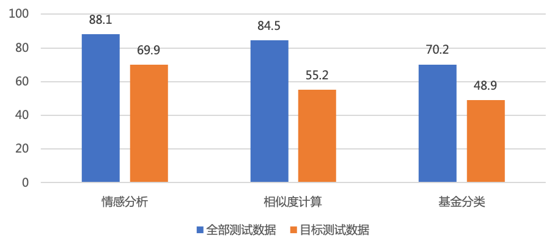

# 训练数据覆盖不足识别及有效数据增强

## 方法介绍

训练数据覆盖不足会导致模型在对应的测试数据上表现不好。数据扩充是提升模型效果首选方法，然而数据标注是一个费时费力的工作，如何标注更少的数据带来更大的效果提升是大多数NLP开发者面临的难题。

<p align="center">
<br>
图1 数据覆盖不足识别及有效数据增强策略流程
</p>

TrustAI提供图1流程，用尽量少的标注数据提升模型效果。首先，基于可信分析中实例级证据分析方法，从测试数据中识别因训练数据覆盖不足而导致预测效果差的测试样本，称作目标集（即证据不足测试数据）。然后，在未标注数据中，选择可作为目标集预测证据的数据进行标注。最后，将新标注的数据加入到训练数据中重训模型。

注：开发者可访问[ AI Studio示例 ](https://aistudio.baidu.com/aistudio/projectdetail/4434403)快速体验本案例。

## 实验步骤

由于标注数据成本高昂，本方案基于相似度计算任务LCQMC数据集进行的模拟实验。

Step1：从LCQMC训练数据中随机抽取5000条作为训练集，剩余数据作为未标注数据集。基于ERNIE-3.0-base-zh在抽取的训练集`train_5000.tsv`微调得到相似度计算基线模型，运行命令如下所示：

```shell
# 下载数据
wget --no-check-certificate https://trustai.bj.bcebos.com/application_data/sparse_data.tar && tar xf sparse_data.tar && rm sparse_data.tar
# 训练基线模型
python -u train.py --dataset_dir ./data --train_file train_5000.tsv --dev_file dev.tsv --test_files test.tsv DuQM --num_classes 2 --save_dir ./checkpoint
```
训练的基线模型保存在`checkpoint`目录中。


Step2：基于基线模型从验证集中选择目标数据，即为**目标集**。
目标集选择方法：基于TrustAI提供的实例级证据分析方法`FeatureSimilarityModel`，针对验证集中每一条样本，计算每一训练样本作为其支持证据的分数；然后基于所有训练数据，计算每一验证样本的平均证据支持分数。分数较低的样本表明其训练证据不足，将其加入到目标集中。

```shell
# 选取目标数据
python -u find_sparse_data.py --dataset_dir ./data --train_file train_5000.tsv --dev_file dev.tsv --num_classes 2  --init_from_ckpt ./checkpoint/model_state.pdparams --sparse_num 50 --sparse_path ./data/sparse_data.tsv
# sparse_num表示选择的目标数据的数量
# sparse_path表示目标集存储的路径
```

经验证，模型在目标集上的效果降低明显，如图2所示。
<p align="center">
<br>
图2 模型在整个测试集和目标集上的表现
</p>


Step3：针对目标集中数据，再次利用`FeatureSimilarityModel`方法从未标注数据集`rest_train.tsv`中选择可支持它们预测的数据进行人工标注。

<font size=3 color=gray>注：此处为模拟实验，`rest_train.tsv`的数据已被标注</font>

```shell
# 选取有效数据
python -u find_valid_data.py --dataset_dir ./data --unlabeled_file rest_train.tsv --target_file sparse_data.tsv --num_classes 2  --init_from_ckpt ./checkpoint/model_state.pdparams --valid_threshold 0.7 --valid_num 1000 --valid_path ./data/valid_data.tsv
# valid_threshold表示目标集证据的分数阈值，开发者可根据自己数据自主调整，默认为0.7
# valid_num表示抽取有效数据的数量
# valid_path表示有效数据的存储路径
```

Step4：完成新选择数据的标注后，将其作为增强数据加入到原训练数据集合中，从新训练模型及评估模型效果。

```shell
# 将标注过的有效集加入到原始训练集
cat ./data/train_5000.tsv ./data/valid_data.tsv > ./data/merge_valid.tsv
# 基于增强后的数据训练模型
python -u train.py --dataset_dir ./data --train_file merge_valid.tsv --dev_file dev.tsv --test_files test.tsv DuQM sparse_data.tsv --num_classes 2 --save_dir ./valid_checkpoint
```
同时，开发者也可以随机选择相同数量的随机数据进行对比实验。实验结果如下表所示：

|   数据集  | 数据量 |  LCQMC<sub>dev</sub>  | LCQMC<sub>test</sub>  |   DuQM  | 目标集 |
| :-------:  | :-------:  | :-----: | :-----: |:-----: |:-----: |
| 基线   | 5000 | 86.31%  | 84.49% | 69.17%  | 55.20% |  
| 基线 + 随机1000条 | 6000 | 86.76% | 85.05% | 69.23% | 55.20% |
| 基线 + 策略1000条 | 6000 | 87.04% | 85.58% | 70.20% | 69.60% |

<font size=3 color=gray>注：以上结果均为10次实验的平均值。</font>
